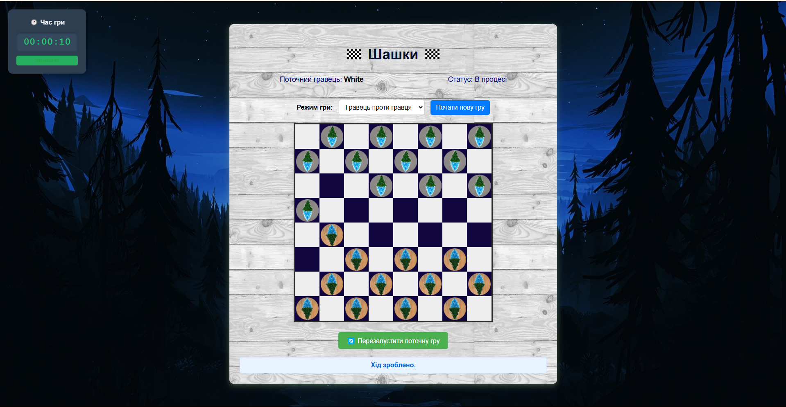
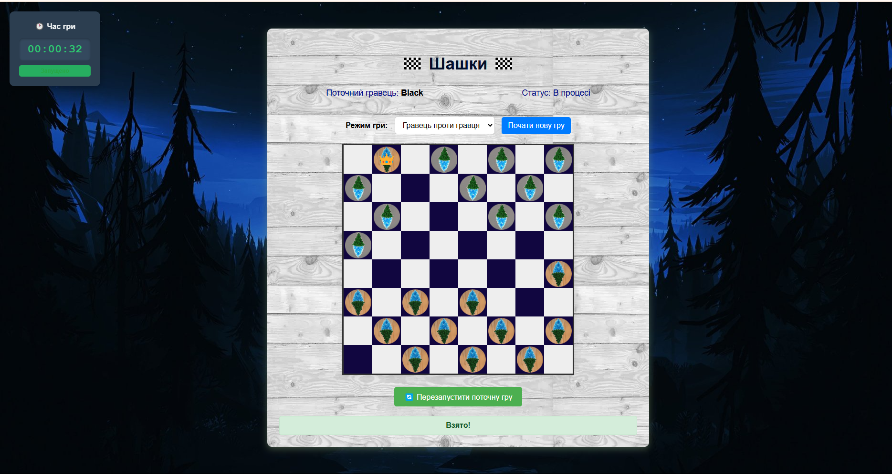
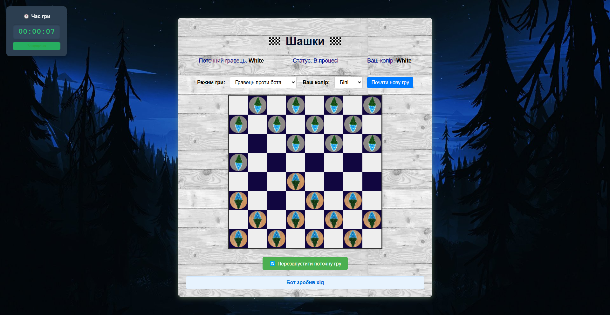
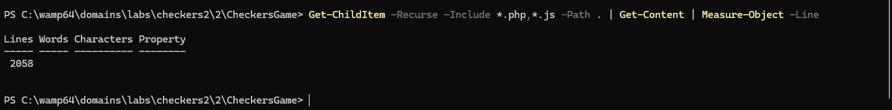

# 🧩 CheckersGame

Проста реалізація гри в шашки з використанням PHP, HTML, CSS та JavaScript.

## 🎮 Функціонал

- 👤 Гравець проти гравця (PvP)
- 🤖 Гравець проти бота (простий бот)
- 🎨 Вибір кольору фігур
- ⏱ Таймер гри
- ✅ Валідація ходів згідно з правилами шашок
- 📌 Обов'язкові взяття
- 👑 Перетворення в дамки
- 🏁 Визначення переможця або нічиєї
- 🔔 Система повідомлень про стан гри
- 🔁 Підтримка мультиходів

## 🚀 Запуск проєкту

1. Встановіть локальний сервер (наприклад, [XAMPP](https://www.apachefriends.org/) або використовуйте вбудований PHP-сервер)
2. Клонуйте репозиторій у папку сервера:
   ```bash
   git clone https://github.com/your-username/CheckersGame.git
   ```
3. Запустіть сервер:
   ```bash
   php -S localhost:8000
   ```
4. Відкрийте у браузері:
   ```
   http://localhost:8000/index.php
   ```

## 📁 Архітектура проєкту

- `index.php` — головна сторінка гри
- `game.php` — основна логіка гри
- `src/` — директорія з ігровими класами:
  - `Bots/` — простий бот, фабрика ботів
  - `Commands/` — реалізація команд (ходів)
  - `Game/` — логіка стану гри, таймер, обробка дій
  - `Interfaces/` — інтерфейси для розширення
  - `Messages/` — система повідомлень
  - `Moves/` — стратегії звичайних і дамкових ходів
  - `Pieces/` — білі, чорні фігури та базовий клас
  - `Validation/` — валідація ходів, правила
- `controller/` — контролер гри
- `js/` — JavaScript таймер і логіка гри
- `css/` — стилі гри

## 🧠 Programming Principles

### SOLID принципи

- **Single Responsibility Principle (SRP)**  
  Кожен клас відповідає за одну функціональність:
  - `GameManager` — керування грою
  - `Board` — стан дошки
  - `Piece` — логіка фігур
  - `GameEndDetector` — визначення кінця гри

- **Open/Closed Principle (OCP)**  
  Класи фігур (`Piece`, `WhitePiece`, `BlackPiece`) можна розширювати без зміни існуючого коду.  
  Стратегії ходів (`RegularMoveStrategy`, `KingMoveStrategy`) реалізують інтерфейс `MoveStrategy`.

- **Liskov Substitution Principle (LSP)**  
  Підкласи фігур (`WhitePiece`, `BlackPiece`) можуть замінювати батьківський клас `Piece` без порушення логіки.

- **Interface Segregation Principle (ISP)**  
  Інтерфейси (`PieceInterface`, `BoardInterface`, `BotInterface`) містять лише необхідні методи без зайвого функціоналу.

- **Dependency Inversion Principle (DIP)**  
  Високорівневі модулі (наприклад, `GameManager`) залежать від абстракцій (`PieceInterface`), а не від конкретних реалізацій.

### Інші принципи

- **DRY (Don't Repeat Yourself)** — уникнення дублювання коду через використання базових класів.
- **KISS (Keep It Simple, Stupid)** — проста і зрозуміла архітектура.

## 🧩 Шаблони проєктування

| Шаблон         | Опис                                                          | Файл(и)                                                      |
|----------------|---------------------------------------------------------------|---------------------------------------------------------------|
| Singleton      | Єдиний екземпляр керування грою                               | `src/Game/GameManager.php`                                   |
| Strategy       | Різні алгоритми ходів                                         | `src/Moves/RegularMoveStrategy.php`, `KingMoveStrategy.php`  |
| Command        | Інкапсуляція команд (ходів)                                   | `src/Commands/CaptureMoveCommand.php`, `RegularMoveCommand.php` |
| Observer       | Сповіщення про зміну повідомлень                              | `src/Messages/MessageService.php`, `MessageObserver.php`     |
| Factory Method | Створення фігур і ботів                                       | `src/PieceFactory.php`, `src/Bots/BotFactory.php`            |
| State          | Управління поточним станом гри                                | `src/Game/GameState.php`                                     |

## 🛠 Техніки рефакторингу

- **Extract Method** — розбиття великих методів на менші
- **Replace Conditional with Polymorphism** — стратегії замість умов
- **Replace Magic Numbers with Constants** — замість чисел, константи
- **Guard Clauses** — вихід при невірних умовах на початку методу
- **Null Object** — повернення `null` замість перевірок
- **Introduce Parameter Object** — параметри ходів передаються у вигляді масиву
- **Encapsulate Field** — поля класів інкапсульовані через getter/setter
- **Replace Inheritance with Delegation** — логіка ходів делегована стратегіям

## 🌐 Особливості реалізації

- Серіалізація гри в сесію PHP
- Асинхронні дії бота 
- Підтримка послідовних взяттів
- Перевірка правил гри у всіх ситуаціях

---

## 📱 Скріншоти

---

## Гравець проти гравця



## Шашка стала дамкою



## Гравець проти бота



## Перевірка кількості рядків



## 🧑‍💻 Автор

**Качур Віталій Васильович**, ВТк-24-1